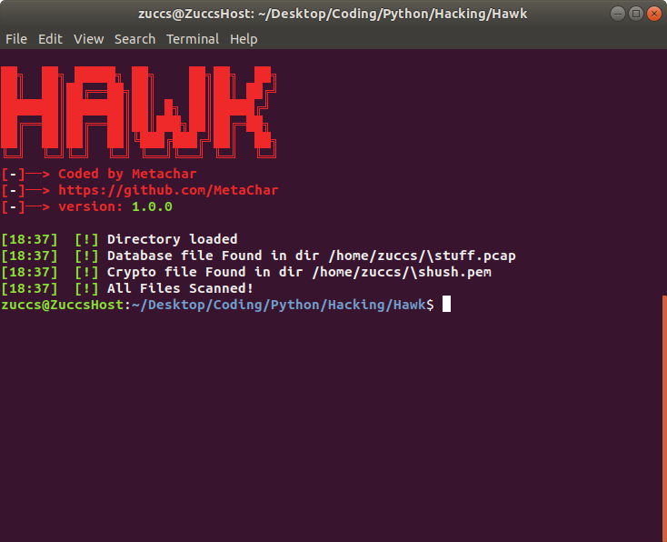

# pyHAWK
Searches the directory of choice for interesting files. Such as database files and files with passwords stored on them


# Features
+ Scans directory for intresting file types
+ Outputs them to the screen
+ Supports many file types 

# Installation Instructions

The installation is easy. Git clone the repo and run go build.

```
git clone https://github.com/MetaChar/pyHAWK
python2 main.py
```


# Usage

``` To set a Directory use -d or --directory
python2 main.py -d <directory>
```

To run it against my home directory, i can pass /home/ice3man as the argument. 
```bash
./hawkeye -d /home/ice3man

# File Extensions
### Cryptography
+ .pem
+ .pkcs12
+ .p12
+ .pfx
+ .asc
+ .jks
+ .keychain

### Password Files
+ .agilekeychain
+ .kwallet
+ .bek
+ .tpm
+ .psafe3

### Database Files
+ .sdf
+ .sqlite
+ .fve
+ .pcap
+ .gnucash
+ .dayone
+ .mdf

### Misc Files
+ .log

### Config Files
+ .cscfg
+ .rdp
+ .tblk
+ .ovpn


#### Insperation
Inspired by ice3man543 check it out here : https://github.com/Ice3man543/hawkeye
